# 🚀 GrantSeeker AI Platform

**Complete AI-powered grant discovery, analysis, and application system using Google Gemma 3 270M-IT**

[](https://creativecommons.org/licenses/by-nc/4.0/)
[](docs/architecture.md)
[](https://huggingface.co/google/gemma-3-270m-it)
[](frontend/)
[](backend/)
[](ai-model/)

## 🎯 Overview

GrantSeeker AI Platform is a comprehensive solution for nonprofits and researchers to discover, analyze, and apply for grants using advanced AI assistance. The platform combines modern web technologies with containerized AI models to provide professional-grade grant writing support.

### ✨ Key Features

- **🔍 Grant Discovery**: Intelligent search and filtering of funding opportunities
- **📊 AI-Powered Analysis**: Automated grant requirement analysis using Gemma 3 270M-IT
- **📝 Smart Form Filling**: AI-assisted grant application completion
- **💰 Cost-Effective**: Production-ready deployment for ~$30-50/month
- **🌐 Production Ready**: Auto-scaling, monitoring, and error handling

## 🏗️ Architecture

### System Overview

```mermaid
graph TB
    %% User Layer
    U[👤 User] -->|Upload PDF| F[🌐 Frontend]
    
    %% Frontend Layer
    subgraph "Frontend Layer (GitHub Pages)"
        F[React + TypeScript SPA]
        F1[GrantFormFiller.tsx]
        F2[GrantAnalyzer.tsx]
        F3[DocumentProcessor.tsx]
        F --> F1
        F --> F2
        F --> F3
    end
    
    %% API Gateway
    F -->|HTTPS API Calls| B[⚡ Azure Functions Backend]
    
    %% Backend Layer
    subgraph "Backend Layer (Azure Functions - Python 3.9)"
        B1[🔄 GemmaProxy]
        B2[📝 FillGrantForm]
        B3[📊 AnalyzeGrant]
        B4[📄 ProcessDocument]
        B5[🕷️ CrawlerService]
        B6[🎯 GetMatches]
        B7[✂️ TokenizerFunction]
        
        B --> B1
        B --> B2
        B --> B3
        B --> B4
        B --> B5
        B --> B6
        B --> B7
    end
    
    %% AI Layer
    B1 -->|HTTP Proxy| AI[🤖 AI Container]
    B2 -->|Field Generation| B1
    
    subgraph "AI Layer (Azure Container Instance)"
        AI[Flask API Server]
        AI1[🧠 Gemma 3 270M-IT Model]
        AI2[📥 Request Queue]
        AI3[💾 Model Cache]
        
        AI --> AI1
        AI --> AI2
        AI --> AI3
    end
    
    %% Infrastructure
    subgraph "Infrastructure"
        I1[📦 GitHub Pages<br/>Static Hosting]
        I2[☁️ Azure Functions<br/>Consumption Plan]
        I3[🐳 Azure Container Instance<br/>13.89.105.77:8000]
    end
    
    %% Data Flow
    F -.->|Hosts| I1
    B -.->|Runs on| I2
    AI -.->|Deployed on| I3
    
    %% Response Flow
    AI1 -->|Generated Text| AI
    AI -->|JSON Response| B1
    B2 -->|Filled PDF| F
    F -->|Download| U
    
    classDef frontend fill:#3B82F6,stroke:#1E40AF,stroke-width:2px,color:#fff
    classDef backend fill:#F59E0B,stroke:#D97706,stroke-width:2px,color:#fff
    classDef ai fill:#8B5CF6,stroke:#7C3AED,stroke-width:2px,color:#fff
    classDef infra fill:#10B981,stroke:#059669,stroke-width:2px,color:#fff
    classDef user fill:#EF4444,stroke:#DC2626,stroke-width:2px,color:#fff
    
    class F,F1,F2,F3 frontend
    class B,B1,B2,B3,B4,B5,B6,B7 backend
    class AI,AI1,AI2,AI3 ai
    class I1,I2,I3 infra
    class U user
```



### Data Flow Architecture

```mermaid
sequenceDiagram
    participant U as 👤 User
    participant F as 🌐 Frontend
    participant B as ⚡ Backend
    participant P as 🔄 GemmaProxy
    participant A as 🤖 AI Container
    
    U->>F: Upload Grant Application PDF
    F->>F: Convert PDF to Base64
    F->>B: POST /api/fillgrantform
    Note over B: FillGrantForm Function
    B->>B: Extract PDF fields (PyPDF2)
    B->>B: Parse with 24 field patterns
    
    loop For each field
        B->>P: Generate field content
        P->>A: POST /generate with prompt
        A->>A: Gemma 3 270M-IT inference
        A-->>P: Generated text response
        P-->>B: Field content
    end
    
    B->>B: Create filled PDF (reportlab)
    B-->>F: Return filled PDF (base64)
    F->>F: Convert to downloadable file
    F-->>U: Download completed application
```



### Component Architecture

```mermaid
flowchart LR
    subgraph "🎨 Frontend Components"
        FC[App.tsx] --> FG[GrantFormFiller.tsx]
        FC --> FA[GrantAnalyzer.tsx]
        FC --> FD[DocumentProcessor.tsx]
        FC --> FAdmin[Admin Dashboard]
    end
    
    subgraph "🔧 Backend Functions"
        BF[Azure Functions App] --> BG[GemmaProxy/]
        BF --> BFF[FillGrantForm/]
        BF --> BA[AnalyzeGrant/]
        BF --> BP[ProcessDocument/]
        BF --> BC[CrawlerService/]
    end
    
    subgraph "🤖 AI Infrastructure"
        AC[Azure Container] --> AF[Flask Server]
        AF --> AM[Gemma Model]
        AF --> AQ[Request Queue]
        AF --> ACC[Model Cache]
    end
    
    subgraph "📦 Dependencies"
        D1[PyPDF2 - PDF Processing]
        D2[reportlab - PDF Generation]  
        D3[requests - HTTP Client]
        D4[transformers - Model Loading]
        D5[torch - ML Framework]
    end
    
    FG -.->|API Calls| BFF
    FA -.->|API Calls| BA
    FD -.->|API Calls| BP
    
    BFF --> BG
    BA --> BG
    BP --> BG
    BG -.->|HTTP Proxy| AF
    
    BFF -.-> D1
    BFF -.-> D2
    BG -.-> D3
    AM -.-> D4
    AM -.-> D5
```



## 🚀 Quick Start

### Prerequisites

- Node.js 18+
- Python 3.10+
- Docker
- Azure CLI
- Azure subscription

### 1. Clone Repository

```bash
git clone https://github.com/your-username/grantseeker-ai-platform.git
cd grantseeker-ai-platform
```

### 2. Deploy AI Model Container

```bash
cd ai-model
./deploy/build-and-deploy.sh
```

### 3. Deploy Backend Functions

```bash
cd backend
func azure functionapp publish ocp10-grant-functions --python
```

### 4. Deploy Frontend

```bash
cd frontend
npm install
npm run build
# Deploy to GitHub Pages or Azure Static Web Apps
```

## 📁 Repository Structure

```
grantseeker-ai-platform/
├── 📁 frontend/                 # React + TypeScript frontend
│   ├── src/components/         # UI components
│   ├── src/pages/             # Page components
│   ├── src/services/          # API services
│   └── package.json           # Dependencies
├── 📁 backend/                 # Azure Functions backend
│   ├── FillGrantForm/         # PDF form filling function
│   ├── TokenizerFunction/     # Text tokenization
│   ├── AnalyzeGrant/          # Grant analysis
│   ├── ProcessDocument/       # Document processing
│   └── requirements.txt       # Python dependencies
├── 📁 ai-model/               # Containerized AI model
│   ├── flask_gemma_api.py     # Flask API server
│   ├── Dockerfile             # Container configuration
│   ├── requirements.txt       # Model dependencies
│   └── deploy/                # Deployment scripts
├── 📁 docs/                   # Documentation
├── 📁 .github/workflows/      # CI/CD pipelines
└── README.md                  # This file
```

## 🤖 AI Model Details

### Google Gemma 3 270M-IT

- **Parameters**: 270 million (optimized for efficiency)
- **Type**: Instruction-tuned language model
- **Deployment**: Containerized on Azure Container Instances
- **Performance**: ~4-6 second generation time
- **Memory**: ~2-3 GB RAM requirement
- **Cost**: Predictable infrastructure pricing

### API Endpoints

```bash
# Health check
GET http://your-container-ip:8000/health

# Text generation
POST http://your-container-ip:8000/generate
{
  "prompt": "Write a grant project description for marine conservation:",
  "max_new_tokens": 100,
  "temperature": 0.7
}
```

## 💰 Cost Analysis

### Monthly Cost Breakdown

| Component | Service | Cost Range |
|-----------|---------|------------|
| **Frontend** | GitHub Pages | Free |
| **Backend** | Azure Functions (Consumption) | $0-10 |
| **AI Model** | Container Instances (8GB) | $30-50 |
| **Storage** | Azure Storage | $1-5 |
| **Total** | **Complete Platform** | **$31-65/month** |

### Cost Comparison

| Solution | Monthly Cost | Limitations |
|----------|--------------|-------------|
| **GrantSeeker AI** | $31-65 | None - full control |
| OpenAI GPT-3.5 API | $100-500+ | Token limits, rate limits |
| Azure OpenAI | $80-300+ | Quota requirements |
| Functions Premium | $73+ | Fixed cost, overprovisioned |

## 📊 Performance Metrics

### Response Times
- **Model Loading**: ~6 seconds (cached)
- **Text Generation**: ~4-6 seconds
- **API Response**: <10 seconds end-to-end
- **Frontend Load**: ~2 seconds

### Quality Metrics
- **Professional Grant Writing**: ✅ High quality output
- **Context Understanding**: ✅ Follows prompts accurately
- **Consistency**: ✅ Reproducible results
- **Language Support**: ✅ English + basic multilingual

## 🛠️ Development

### Local Development Setup

```bash
# Frontend development
cd frontend
npm install
npm run dev  # http://localhost:5173

# Backend development
cd backend
python -m venv venv
source venv/bin/activate  # Windows: venv\Scripts\activate
pip install -r requirements.txt
func start  # http://localhost:7071

# AI Model development
cd ai-model
pip install -r requirements.txt
python flask_gemma_api.py  # http://localhost:8000
```

### Docker Development

```bash
# Build and run AI model container locally
cd ai-model
docker build -t grantseeker-ai .
docker run -p 8000:8000 grantseeker-ai
```

## 🔒 Security

- **Container Security**: Non-root user, minimal base image
- **API Security**: Input validation, rate limiting
- **Network Security**: HTTPS enforced, private container networking
- **Data Privacy**: No persistent storage of user data
- **Model Security**: Local deployment, no external AI API dependencies

## 📈 Scalability

### Current Capacity
- **Concurrent Users**: ~10-20 (single container)
- **Requests/Hour**: ~100-500
- **Model Throughput**: ~10-15 requests/minute

### Scaling Options
- **Horizontal**: Multiple container instances
- **Vertical**: Larger container sizes (up to 14GB)
- **Load Balancing**: Azure Load Balancer + multiple containers
- **Auto-scaling**: Container Groups with scaling rules

## 🧪 Testing

```bash
# Run frontend tests
cd frontend
npm test

# Run backend tests
cd backend
python -m pytest

# Test AI model API
curl -X POST http://localhost:8000/generate \
  -H "Content-Type: application/json" \
  -d '{"prompt": "Test prompt", "max_new_tokens": 50}'
```

## 📚 Documentation

- [**Architecture Guide**](docs/architecture.md) - System design and components
- [**Deployment Guide**](docs/deployment.md) - Step-by-step setup
- [**API Reference**](docs/api.md) - Complete API documentation
- [**Cost Optimization**](docs/cost-optimization.md) - Reducing operational costs
- [**Troubleshooting**](docs/troubleshooting.md) - Common issues and solutions

## 🤝 Contributing

1. Fork the repository
2. Create a feature branch (`git checkout -b feature/amazing-feature`)
3. Commit your changes (`git commit -m 'Add amazing feature'`)
4. Push to the branch (`git push origin feature/amazing-feature`)
5. Open a Pull Request

## 📄 License

This project is licensed under the **Creative Commons Attribution-NonCommercial 4.0 International License**.

### 🎓 Academic & Learning Use
- ✅ **Free to use** for learning, research, and educational purposes
- ✅ **Share and adapt** the code with proper attribution
- ✅ **Study the architecture** for academic research

### 🚫 Commercial Restrictions
- ❌ **No commercial use** without explicit permission
- ❌ **No selling** or monetizing the platform directly
- ❌ **No commercial deployment** without licensing agreement

### 💼 Commercial Licensing
For commercial use, enterprise licensing, or business deployment:
- **Contact**: [Add your contact information]
- **Custom licensing** available for businesses
- **Enterprise support** and customization options

See the [LICENSE](LICENSE) file for complete terms.

## 🙏 Acknowledgments

- **Google Gemma Team** - For the excellent 270M-IT model
- **Hugging Face** - For model hosting and transformers library
- **Microsoft Azure** - For cost-effective cloud infrastructure
- **Open Source Community** - For the amazing tools and libraries

## 📞 Support

- **Issues**: [GitHub Issues](https://github.com/your-username/grantseeker-ai-platform/issues)
- **Discussions**: [GitHub Discussions](https://github.com/your-username/grantseeker-ai-platform/discussions)
- **Documentation**: [Wiki](https://github.com/your-username/grantseeker-ai-platform/wiki)

---

**Built with ❤️ for the nonprofit and research community**

*Empowering organizations to secure funding through AI-assisted grant writing*