# 🏗️ GrantSeeker AI Platform - Architecture Documentation

## Table of Contents
- [System Overview](#system-overview)
- [Architecture Patterns](#architecture-patterns)
- [Component Details](#component-details)
- [Data Flow](#data-flow)
- [Infrastructure](#infrastructure)
- [Security Architecture](#security-architecture)
- [Performance Architecture](#performance-architecture)
- [Scalability Considerations](#scalability-considerations)

## System Overview

The GrantSeeker AI Platform follows a **microservices architecture** with clear separation of concerns across three main layers:

1. **Frontend Layer**: React SPA hosted on GitHub Pages
2. **Backend Layer**: Serverless Azure Functions (Python)
3. **AI Layer**: Containerized Gemma 3 270M-IT model

```mermaid
graph TB
    subgraph "User Interface"
        U[👤 Users] --> F[🌐 Frontend SPA]
    end
    
    subgraph "Application Layer"
        F -->|HTTPS API| B[⚡ Backend Functions]
        B -->|HTTP| AI[🤖 AI Container]
    end
    
    subgraph "Infrastructure Layer"
        F -.-> GH[GitHub Pages]
        B -.-> AF[Azure Functions]
        AI -.-> ACI[Azure Container Instance]
    end
```



## Architecture Patterns

### 1. **Proxy Pattern**
- **GemmaProxy** acts as a gateway to the AI model
- Centralizes authentication, logging, and error handling
- Provides consistent API interface for all functions

### 2. **Function-as-a-Service (FaaS)**
- Each backend capability is a separate Azure Function
- Auto-scaling based on demand
- Pay-per-execution cost model

### 3. **Container-First AI**
- AI model runs in dedicated container
- Predictable performance and costs
- Full control over model deployment and updates

### 4. **Static Site Architecture**
- Frontend compiled to static assets
- CDN distribution via GitHub Pages
- Optimal performance and zero backend costs for UI

## Component Details

### Frontend Components


### Backend Functions


#### Function Responsibilities

| Function | Purpose | Dependencies |
|----------|---------|--------------|
| **GemmaProxy** | AI model gateway and request routing | requests, logging |
| **FillGrantForm** | PDF form filling with AI assistance | PyPDF2, reportlab, GemmaProxy |
| **AnalyzeGrant** | Grant opportunity analysis | beautifulsoup4, GemmaProxy |
| **ProcessDocument** | Document parsing and extraction | PyPDF2, pandas |
| **CrawlerService** | Grant discovery web crawling | aiohttp, sqlalchemy |
| **GetMatches** | Grant matching algorithm | pandas, sqlalchemy |
| **TokenizerFunction** | Text tokenization services | transformers |

### AI Infrastructure


## Data Flow

### Grant Form Filling Flow


### Request/Response Patterns

#### API Request Format
```json
{
  "pdf_data": "base64_encoded_pdf_content",
  "ngo_profile": {
    "organization_name": "Community Health Alliance",
    "mission": "Providing healthcare access",
    "years_active": 5,
    "focus_areas": ["health", "community"],
    "annual_budget": 500000
  },
  "grant_context": {
    "funder_name": "Health Foundation",
    "focus_area": "community health",
    "max_amount": 50000
  }
}
```

#### AI Model Request Format
```json
{
  "prompt": "Generate grant application content...",
  "max_new_tokens": 100,
  "temperature": 0.5
}
```

## Infrastructure

### Hosting Architecture


### Resource Configuration

| Resource | Type | Configuration | Cost/Month |
|----------|------|---------------|------------|
| **Frontend** | GitHub Pages | Static hosting, CDN | Free |
| **Backend** | Azure Functions | Consumption plan, Python 3.9 | $0-10 |
| **AI Model** | Container Instance | 8GB RAM, 2 vCPUs | $30-50 |
| **Storage** | Azure Storage | Blob storage for logs | $1-5 |

## Security Architecture

### Network Security

```mermaid
graph LR
    Internet[🌐 Internet] -->|HTTPS| GH[GitHub Pages]
    Internet -->|HTTPS| AF[Azure Functions]
    AF -->|HTTP*| CI[Container Instance]
    
    subgraph "Security Layers"
        SSL[SSL/TLS Termination]
        CORS[CORS Policy]
        Input[Input Validation]
        RateLimit[Rate Limiting]
    end
    
    GH --> SSL
    AF --> SSL
    AF --> CORS
    AF --> Input
    CI --> RateLimit
    
    Note1[* HTTP within Azure network]
```



### Data Security

- **No Persistent Storage**: All processing is stateless
- **Memory-Only Processing**: PDFs processed in function memory
- **Auto-Cleanup**: Temporary data cleared after processing
- **Input Validation**: All inputs sanitized and validated

### Authentication Flow


## Performance Architecture

### Caching Strategy


### Performance Metrics

| Component | Metric | Target | Actual |
|-----------|--------|---------|---------|
| **Frontend Load** | Time to Interactive | < 3s | ~2s |
| **API Response** | 95th percentile | < 30s | ~10s |
| **AI Inference** | Generation time | < 10s | ~4-6s |
| **PDF Processing** | File processing | < 5s | ~2-3s |

### Optimization Techniques

1. **Frontend Optimizations**
   - Code splitting with React.lazy()
   - Image optimization and compression
   - Bundle size optimization with Vite

2. **Backend Optimizations**
   - Function memory tuning (512MB-1GB)
   - Connection pooling for HTTP requests
   - Efficient PDF processing algorithms

3. **AI Optimizations**
   - Model quantization for faster inference
   - Request batching where possible
   - Memory-efficient prompt construction

## Scalability Considerations

### Current Limitations

- **Single Container Instance**: 10-20 concurrent users
- **Memory Constraints**: 6GB RAM for AI model
- **Geographic Distribution**: Single Azure region

### Scaling Strategies

#### Horizontal Scaling


#### Vertical Scaling
- Increase container resources (up to 14GB RAM)
- Use larger VM sizes for Azure Functions
- Optimize model loading and caching

#### Geographic Distribution
- Deploy containers in multiple Azure regions
- Use Azure Front Door for global load balancing
- Implement region-specific routing

### Monitoring and Alerting


## Cost Architecture

### Current Cost Breakdown
- **Total Monthly Cost**: $31-65
- **Primary Cost Driver**: AI container hosting (~$30-50)
- **Variable Costs**: Azure Functions execution time
- **Fixed Costs**: Container instance base rate

### Cost Optimization Strategies
1. **Container Scheduling**: Stop/start based on usage patterns
2. **Function Optimization**: Reduce execution time and memory usage
3. **Regional Selection**: Choose cost-effective Azure regions
4. **Reserved Instances**: Use reserved pricing for predictable workloads

---

This architecture provides a solid foundation for the GrantSeeker AI Platform with clear separation of concerns, scalability options, and cost-effective resource utilization.